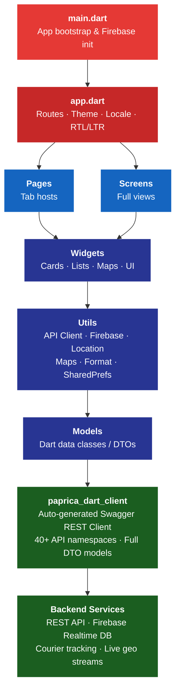
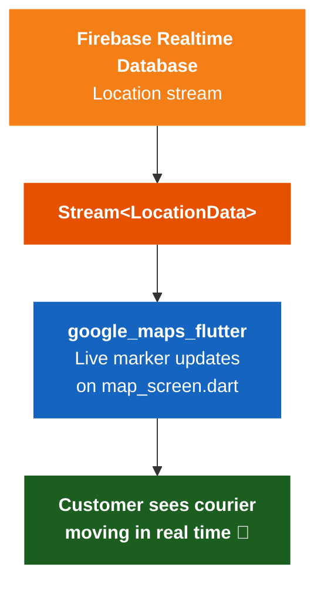

<div align="center">

# Paprika — Customer App

**Discover · Reserve · Order · Track · Experience**

[](https://flutter.dev)
[](https://dart.dev)
[](https://semver.org)
[](https://github.com/alihaidar0/paprika-flutter/pulls)
[](https://flutter.dev/multi-platform)
[](https://firebase.google.com)
[](https://swagger.io)
[](https://github.com/alihaidar0/paprika-flutter/stargazers)
[](https://github.com/alihaidar0/paprika-flutter/issues)

<br/>

> A production-grade **FoodTech Flutter application** — the customer-facing layer of the Paprika restaurant platform.
> Built for the Middle East market with full **Arabic/English RTL support**, real-time **courier tracking**,
> Firebase-powered **live data streams**, table **reservations**, food **delivery & pickup ordering**,
> and a unique **in-restaurant QR experience** — all in a single cross-platform app.

<br/>

</div>

---

## 📱 App Preview

| Home & Discovery | Restaurant & Map | Orders & Tracking |
|:-:|:-:|:-:|
|  |  |  |
| Featured & nearby restaurants with smart filters | Google Maps integration & restaurant locator | Real-time courier tracking & order management |

---

## ✨ Key Features

### 🛵 Real-Time Courier Tracking
- Live **courier location streaming** on an embedded Google Map
- Real-time delivery status updates via **Firebase Realtime Database**
- Geolocation-aware nearest restaurant & delivery zone detection
- Background location handling with device permission management

### 🍽️ Restaurant Discovery
- Browse **featured** and **nearby** restaurants powered by live geolocation
- Advanced **multi-filter** system: cuisine type, restaurant type, shisha, outdoor seating, alcohol, parking, music
- Full-text **search** across restaurants, menus, events, and offers
- Dual view: **list mode** and interactive **map mode**

### 📅 Reservations
- Create, update, and cancel **table reservations** with date/time selection
- View **upcoming** and **past reservations** in a unified timeline
- Push notification reminders via **Firebase Cloud Messaging**

### 🛍️ Delivery & Pickup
- Full **delivery order flow** with meal customisation, quantity control, and region-aware delivery zones
- **Pickup order scheduling** with custom meal selections and time slots
- Unified history view for all **past and upcoming** orders

### 🎉 Events & Offers
- Browse restaurant **events** with sharing to native platforms
- Explore exclusive **offers** with deep-link support via universal links
- My Paprika personalised feed: curated offers and event recommendations

### 👤 Authentication & Profiles
- **Email/password** registration and login
- **Google Sign-In** and **Facebook Login** social OAuth
- Phone number **OTP confirmation** and update flow
- Full profile management with avatar upload via camera or gallery

### 🔔 Push & Local Notifications
- **Firebase Cloud Messaging** for server-triggered push notifications
- **Local notifications** for reservation confirmations and order updates
- In-app notification centre with read/unread state management

### 🌶️ Paprika Inside *(In-Restaurant QR Experience)*
- Embedded **Flutter module** activated via QR code at the table
- Browse the **restaurant menu** without calling a waiter
- **Get Assistant** — digital table service request
- View the venue's live **music playlist**
- Submit instant **feedback** from the table
- View and track your **invoice** in real time

### 🌍 Internationalisation & RTL
- Full **Arabic (ar)** and **English (en)** localisation
- Complete **RTL layout** support throughout all screens
- Custom Arabic typography: **Frutiger LT Arabic** + **Hacen Tunisia**
- Region-aware content: countries, cities, regions

---

## 🛠️ Tech Stack & Libraries

### Core Framework
| Package | Version | Purpose |
|---|---|---|
| `flutter` | SDK 2.x | Cross-platform UI framework |
| `flutter_localizations` | SDK | Arabic & English i18n / RTL support |
| `dart` | ≥ 2.1.0 | Language runtime |

### Firebase Services
| Package | Version | Purpose |
|---|---|---|
| `firebase_messaging` | ^7.0.3 | Push notifications via FCM |
| `flutter_local_notifications` | latest | Local notification scheduling |
| `google_sign_in` | ^4.5.6 | Firebase / Google OAuth 2.0 |

> 🔥 **Firebase Realtime Database** powers live courier location streaming — configured via the native Firebase SDK in `android/app/google-services.json`.

### REST API & Backend Integration
| Package | Version | Purpose |
|---|---|---|
| `swagger` (paprica_dart_client) | path | Auto-generated Swagger/OpenAPI client (40+ endpoint namespaces) |
| `connectivity` | ^2.0.2 | Network availability detection |
| `uni_links` | ^0.4.0 | Deep links & universal links |
| `url_launcher` | ^6.0.3 | External URLs, phone & email |

### Maps & Real-Time Location
| Package | Version | Purpose |
|---|---|---|
| `google_maps_flutter` | ^1.0.6 | Embedded Google Maps (courier tracking & restaurant map) |
| `location` | ^3.2.4 | Real-time GPS stream & permission management |

### State & Storage
| Package | Version | Purpose |
|---|---|---|
| `shared_preferences` | ^2.0.5 | Persistent key-value storage (auth token, settings) |
| `sqflite` | ^1.3.2+1 | Local SQLite database |

### UI & Visual Components
| Package | Version | Purpose |
|---|---|---|
| `cached_network_image` | ^2.3.3 | Efficient image loading & disk caching |
| `transparent_image` | ^1.0.0 | Fade-in placeholder for network images |
| `shimmer` | ^1.1.2 | Skeleton loading animations |
| `photo_view` | ^0.10.3 | Pinch-to-zoom image gallery |
| `flutter_svg` | ^0.21.0+1 | SVG icon rendering |
| `flutter_spinkit` | ^4.1.2+1 | Animated loading spinners |
| `convex_bottom_bar` | ^2.6.0 | Stylised bottom navigation bar |
| `percent_indicator` | ^2.1.8 | Circular & linear progress indicators |
| `circular_check_box` | ^1.0.4 | Custom checkbox widget |
| `font_awesome_flutter` | ^8.10.0 | Extended icon set |
| `flutter_picker` | ^2.0.1 | iOS-style picker dialogs |

### Auth & Social Login
| Package | Version | Purpose |
|---|---|---|
| `google_sign_in` | ^4.5.6 | Google OAuth 2.0 |
| `flutter_facebook_login` | ^3.0.0 | Facebook OAuth |

### Media & Sharing
| Package | Version | Purpose |
|---|---|---|
| `image_picker` | ^0.6.7+22 | Camera & gallery image selection |
| `audioplayers` | ^0.18.3 | In-restaurant music playback |
| `share` | ^2.0.1 | Native OS share sheet |

### Utilities
| Package | Version | Purpose |
|---|---|---|
| `intl` | ^0.17.0 | Date, number & currency formatting |
| `package_info` | ^0.4.3+4 | App version & build metadata |
| `app_settings` | ^4.0.4 | Open device OS settings |
| `incrementally_loading_listview` | latest | Infinite scroll / paginated list loading |

---

## 🏗️ Architecture Overview

Paprika follows a **feature-first layered architecture** with clear separation between data, business logic, and UI — co-designed with the backend team around a **Swagger-documented REST API** and real-time **Firebase data streams**.



### Module Structure

| Module | Type | Description |
|---|---|---|
| `paprika` (root) | Main App | Full customer-facing Flutter application |
| `paprika_inside` | Flutter Module | In-restaurant QR experience (embedded) |
| `paprica_dart_client` | Dart Package | Auto-generated Swagger/OpenAPI REST client |

### Real-Time Courier Tracking Flow



---

## 🚀 Getting Started

### Prerequisites

```bash
# Flutter SDK (stable channel, 2.x)
flutter --version

# Dart SDK (≥ 2.1.0)
dart --version

# Android Studio with SDK platform & emulator configured
# OR a physical Android device with USB debugging enabled

# macOS only — for iOS builds
xcode-select --version
pod --version          # CocoaPods ≥ 1.10
```

### 1. Clone the Repository

```bash
git clone https://github.com/alihaidar0/paprika-flutter.git
cd paprika-flutter
```

### 2. Install All Dependencies

```bash
# Root customer app
flutter pub get

# In-restaurant embedded module
cd paprika_inside && flutter pub get && cd ..

# Auto-generated Swagger API client
cd paprica_dart_client && flutter pub get && cd ..
```

### 3. Firebase Setup

> ⚠️ **Required** — the app will not launch without valid Firebase config files.

1. Go to [console.firebase.google.com](https://console.firebase.google.com) → create a new project
2. **Android**: Register app with package name `com.paprika_sy.customer`
   - Download `google-services.json` → place in `android/app/`
3. **iOS**: Register app with bundle ID from `ios/Runner/Info.plist`
   - Download `GoogleService-Info.plist` → place in `ios/Runner/`
4. In the Firebase Console, enable:
   - **Authentication** — Email/Password, Google, Facebook providers
   - **Cloud Messaging (FCM)** — push notifications
   - **Realtime Database** — courier location streaming

### 4. Google Maps API Key

**Android** — `android/app/src/main/AndroidManifest.xml`:
```xml
<meta-data
    android:name="com.google.android.geo.API_KEY"
    android:value="YOUR_GOOGLE_MAPS_API_KEY" />
```

**iOS** — `ios/Runner/AppDelegate.m`:
```objc
#import "GoogleMaps/GoogleMaps.h"
// Inside application:didFinishLaunchingWithOptions:
[GMSServices provideAPIKey:@"YOUR_GOOGLE_MAPS_API_KEY"];
```

### 5. Configure API Base URL

Open `lib/src/utils/paprica_api_client.dart` and set your backend:

```dart
static const String baseUrl = 'https://your-api-domain.com';
```

### 6. Run the App

```bash
# List connected devices
flutter devices

# Run in debug mode
flutter run -d <device_id>

# Run in release mode
flutter run --release
```

### 7. Build for Production

```bash
# Android APK
flutter build apk --release

# Android App Bundle (recommended for Play Store)
flutter build appbundle --release

# iOS Archive (macOS + Xcode required)
flutter build ios --release
open ios/Runner.xcworkspace    # Then Product → Archive in Xcode
```

---

## 📁 Project Structure

```
lib/
├── main.dart                        # Bootstrap: Firebase init, app entry point
├── app.dart                         # MaterialApp, routing, locale, RTL/LTR
├── pages.dart                       # Barrel: tab-level page exports
├── screens.dart                     # Barrel: full-screen view exports
├── widgets.dart                     # Barrel: reusable widget exports
├── utils.dart                       # Barrel: utility class exports
├── theme.dart                       # Barrel: theme exports
├── translations.dart                # Barrel: i18n exports
├── error_handlers.dart              # Barrel: error handler exports
│
├── generated/
│   └── i18n.dart                    # Auto-generated localisation bindings
│
└── src/
    ├── models/                      # Pure Dart data models (20 files)
    │   ├── restaurants_list_model.dart
    │   ├── reservation_model.dart
    │   ├── delivery_model.dart
    │   ├── pickup_model.dart
    │   ├── event_model.dart
    │   ├── offer_model.dart
    │   ├── review_comment.dart
    │   ├── notification.dart
    │   ├── paprika_filter_model.dart
    │   └── ...
    │
    ├── pages/                       # Tab container pages (9 files)
    │   ├── discover_page.dart       # Home feed with featured restaurants
    │   ├── restaurants_page.dart    # Restaurant list + filter entry
    │   ├── restaurant_home_page.dart
    │   ├── restaurant_menu_page.dart
    │   ├── restaurant_reviews_page.dart
    │   ├── my_paprika_page.dart     # Personalised offers & events
    │   ├── profile_page.dart
    │   ├── more_page.dart
    │   └── service_page.dart
    │
    ├── screens/                     # Full-screen Navigator views (23 files)
    │   ├── splash_screen.dart
    │   ├── login_screen.dart
    │   ├── signup_screen.dart
    │   ├── home_screen.dart
    │   ├── restaurant_screen.dart
    │   ├── restaurants_list_screen.dart
    │   ├── restaurants_map_screen.dart  # 🗺️ Map-based restaurant discovery
    │   ├── map_screen.dart              # 🛵 Live courier tracking map
    │   ├── delivery_screen.dart
    │   ├── deliveries_screen.dart
    │   ├── pickup_screen.dart
    │   ├── pickups_screen.dart
    │   ├── reservations_screen.dart
    │   ├── event_screen.dart
    │   ├── events_list_screen.dart
    │   ├── offer_screen.dart
    │   ├── offers_list_screen.dart
    │   ├── notifications_screen.dart
    │   ├── confirm_phone_number_screen.dart
    │   ├── change_password_screen.dart
    │   ├── update_phone_number_screen.dart
    │   ├── about_us_screen.dart
    │   └── forget_password_screen.dart
    │
    ├── widgets/                     # Reusable UI components (28 files)
    │   ├── restaurant_list_view.dart
    │   ├── reservation_card.dart
    │   ├── reservation_list_view.dart
    │   ├── delivery_card.dart
    │   ├── pickup_card.dart
    │   ├── event_card.dart
    │   ├── events_list_view.dart
    │   ├── offer_card.dart
    │   ├── offers_list_view.dart
    │   ├── rating_bar.dart
    │   ├── carousel_slider.dart
    │   ├── images_gallery.dart
    │   ├── open_poll_card.dart
    │   ├── published_poll_card.dart
    │   ├── input.dart
    │   ├── dialog.dart
    │   └── ...
    │
    ├── theme/
    │   └── paprika_theme.dart       # Colours, typography, component themes
    │
    ├── utils/
    │   ├── paprica_api_client.dart  # HTTP client, base URL, auth headers
    │   ├── firebase.dart            # FCM init, token fetch, topic subscribe
    │   ├── location_provider.dart   # GPS stream & permission management
    │   ├── map_utils.dart           # Polylines, markers, distance helpers
    │   ├── paprika_formatter.dart   # Dates, prices, Arabic number formatting
    │   ├── shared_preference.dart   # Auth token & settings persistence
    │   ├── api_types_helper.dart    # Enum ↔ API string conversion helpers
    │   └── backend_enums_mirror.dart # Mirrors backend enum definitions
    │
    └── erro_handlers/
        ├── api_error.dart           # Structured API error model
        └── api_error_handler.dart   # Centralised HTTP error parsing & display
```

---

## 🔐 Security Notes

- ✅ `*.jks` and `*.keystore` are in `.gitignore` — never commit Android signing keys
- ⚠️ Add `google-services.json` to `.gitignore` before making the repo public
- ⚠️ Add `GoogleService-Info.plist` to `.gitignore` before making the repo public
- ⚠️ Store your API base URL in environment config or CI/CD secrets — not hardcoded
- ⚠️ The Android signing key must live in a secure vault (GitHub Secrets, Azure Key Vault, etc.)

---

## 🌐 Localisation

The app is fully localised in **Arabic (ar)** and **English (en)** with complete RTL layout support.

| File | Language |
|---|---|
| `res/values/strings_en.arb` | English |
| `res/values/strings_ar.arb` | Arabic |
| `lib/generated/i18n.dart` | Auto-generated Dart bindings |

**Custom Arabic Typefaces:**
- `FrutigerLTArabic` — Light, Roman, Bold weights (body & UI)
- `Hacen Tunisia Lt` — Display headings
- `UniversNextArabic` — Body text fallback

To regenerate localisation strings after adding new keys:

```bash
flutter pub run intl_translation:extract_to_arb \
  --output-dir=res/values lib/translations.dart

flutter pub run intl_translation:generate_from_arb \
  --output-dir=lib/generated \
  lib/translations.dart res/values/*.arb
```